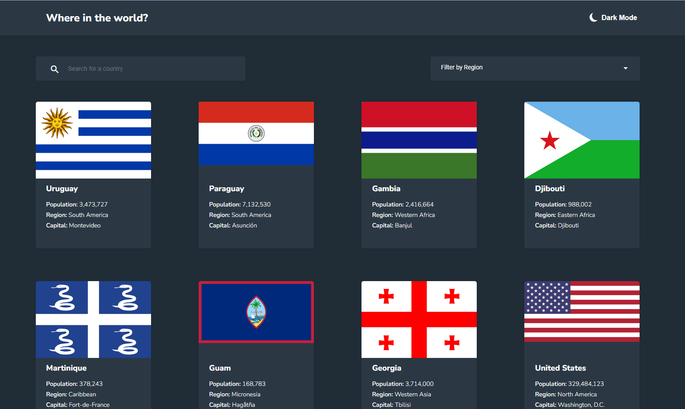
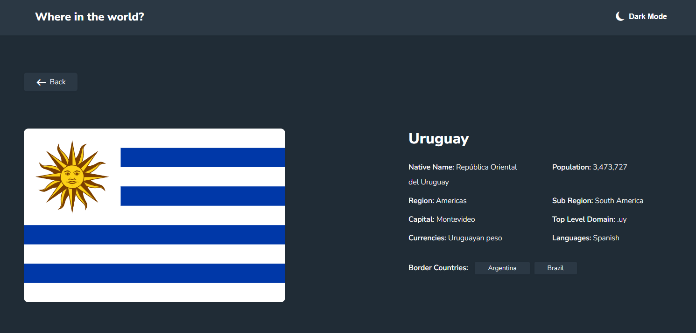
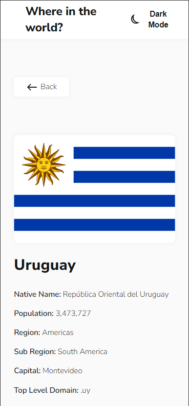

# Frontend Mentor - REST Countries API with color theme switcher solution

This is a solution to the [REST Countries API with color theme switcher challenge on Frontend Mentor](https://www.frontendmentor.io/challenges/rest-countries-api-with-color-theme-switcher-5cacc469fec04111f7b848ca). Frontend Mentor challenges help you improve your coding skills by building realistic projects.

## Table of contents

- [Overview](#overview)
  - [The challenge](#the-challenge)
  - [Screenshot](#screenshot)
  - [Links](#links)
- [My process](#my-process)
  - [Built with](#built-with)
  - [What I learned](#what-i-learned)

## Overview

### The challenge

Users should be able to:

- See all countries from the API on the homepage
- Search for a country using an `input` field
- Filter countries by region
- Click on a country to see more detailed information on a separate page
- Click through to the border countries on the detail page
- Toggle the color scheme between light and dark mode *(optional)*

### Screenshot

### Links

- Solution URL: [Github](https://github.com/JDillon522/frontendmentor-rest-countries-api)
- Live Site URL: [GitHub Pages](https://jdillon522.github.io/frontendmentor-rest-countries-api/home)

## My process
This time I started by generating almost every component, service, and route at the beginning. The design is quite simple so it was easy to forecast what was needed. Also, I got a bit lazy and threw most of my styles (mixins, variables, atoms, etc) into just the one stylesheet. *shrug*

### Built with

- Angular

### What I learned
I wanted another chance from scratch on using pure reactive techniques (vs imperative) in my code. I succeeded in getting everything to work without any direct subscriptions.

However, I had a number of issues getting things like `combineLatest` to work with `BehaviorSubject`s. The default value in a `BehaviorSubject` wasnt emitting when it was referenced in an Async pipe.

Honestly, I met my goal of fiddling with an API purely reactively and I started getting lazy at the end. I just wanted to wrap the project up.
